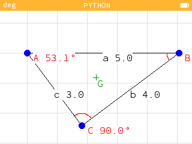

# Make a triangle

## Description
C'est un programme en Micro-python conçu pour fonctionner sur une calculatrice [Numworks](https://www.numworks.com/) ou émulateur. Il permet de visualiser un triangle grace au longueur de ses côtés dans repére interactif. Le programme utilise Numworks Python 2D Engin pour afficher triangle et la gestion de du repére.

### Ilustration

## Installation
1. Brancher votre calculatrice Numworks à votre ordinateur avec un cable qui suppote le transfert de données.
2. Ouvrer le navigateur Google Chrome (Important).
4. ALlez sur https://my.numworks.com/python/546f6d/make_triangle, et cliquer sur le bouton "Envoyer sur ma calculatrice". Vous devrez peut-être vous connecter à votre compte Numworks ou en créer un si vous n'en avez pas encore.
5. Si vous n'avez pas déja connecté votre calculatrice au navigateur, le site vous demandera de le faire.
6. Une fois le programme transféré, vous pouvez débrancher la calculatrice. Puis vous vérez le programme dans la catégorie "Python" de votre calculatrice.
7. Et voilà, le programme est installé et prêt à être utilisé !

## Participation
Si vous voulez participer au développement de ce programme, vous y êtes le bienvenu ! Tout aide est appréciée, que ce soit pour corriger des bugs, ajouter des nouvelles fonctionnalités ou en améliorer, même pour des modifications superficielles comme la correction de fautes d'orthographe ou l'amélioration de la documentation.

Ce projet nécessite surtout des connaissances en **mathématiques** pour créer et **obtimiser** les algorithmes. Alors même si vous ne vous y connaissez pas en Python, vous pouvez toujours contribuer en proposant des idées ou en testant le programme !

Vous pouvez participer au code en suivant ces étapes :
1. Forker le dépôt.
2. Créer une nouvelle branche pour votre fonctionnalité ou correction de bug / Ou commit(s) pour une ou des modification superficiel.
3. Apporter vos modifications.
4. Soumettre une pull request.
5. Je vais examiner votre pull request et, si elle est approuvée, je l'intégrerai dans le dépôt principal. Vous serez alors un contributeur officiel du projet !

## Avertissement
Le programme contient l'integralité de des modules externe utilisés. Il est donc **lourd** et prend une place importante sur la mémoire de la calculatrice. Le programme est également **lent** et énnergivore. Il est recommendé de ne pas le laisser tourner trop longtemps.

## Numworks Python 2D Engin
Numworks Python 2D Engin est pour l'instant un projet expérimental qui permet de créer des programmes graphiques en 2D. Il s'agit de la partie la plus importante et complexe du programme. Je l'ai développé à la base pour Make a triangle, mais il est prévu de lui donner son propre dépôt à l'avenir. Alors n'hésitez pas à l'améliorer si l'envie vous en prend ! Ou à l'utiliser.

## Developpement

Pour le développement, je recommande d'utiliser l'extension [Numworks Simulator](https://marketplace.visualstudio.com/items?itemName=k-kuroguro.numworks-simulator) sinon vous pouvez utiliser le logiciel [Python](https://www.python.org/) en version 3.12 ou supérieur. Dans ce cas la, suivez les instruction ci-dessous en fonction de votre système d'exploitation :

### Windows
1. Clonez le dépôt (ou pluteôt votre fork) sur votre ordinateur `git clone URL_DU_DEPOT`.
2. Ouvrez une invite de commande et naviguez jusqu'au dossier du dépôt cloné.
3. Créer un environnement virtuel python avec la commande `python -m venv .env`.
4. Activez l'environnement virtuel avec la commande `.\.env\Scripts\activate`.
5. Installez les dépendances nécessaires avec la commande `pip install -r requirements.txt`.
6. Vous pouvez maintenant exécuter le programme avec la commande `python make_a_triangle.py`.

### Linux / MacOS
1. Clonez le dépôt (ou pluteôt votre fork) sur votre ordinateur `git clone URL_DU_DEPOT`.
2. Ouvrez un terminal et naviguez jusqu'au dossier du dépôt cloné.
3. Créer un environnement virtuel python avec la commande `python3 -m venv .env`.
4. Activez l'environnement virtuel avec la commande `source .env/bin/activate`.
5. Installez les dépendances nécessaires avec la commande `pip install -r requirements.txt`.
6. Vous pouvez maintenant exécuter le programme avec la commande `python make_a_triangle.py`.